# Slow Changing Dimensions <br/> A **Palantir Foundry** Perspective
          
## Collab     
1. [Prashant Jha](https://github.com/PrashantJha29), [LinkedIn](https://www.linkedin.com/in/prashantjha29/)    
2. [Anudeep Chatradi](https://github.com/anudeepchatradi), [LinkedIn](https://www.linkedin.com/in/anudeep-chatradi-78757298/)    
    
     
#### Housekeeping stuff
- `prev_dim_*` = previous dim dataset
- `src_*` = new snapshot/delta
- Foundry: `@transform`, `Input`, `Output` used as standard
- Code is illustrative, not full error-handled implementations
   
---   
    
## TL;DR  
Palantir Foundry outshines other data pipeline solutions (AWS, GCP, Azure ADF, DataBricks, Spark Declarative Pipelines) in handling of Slow-Chaning dimensions, esp. when it comes to mission critical enterprise data - high voloume, high variety, high scrutiny, lineage and auditability, high security.
This is a summary view of all the benefits of Foundry.  
    
    

    
        
We'll dig deeper, use 2 kinds of examples - insurance and supply chain - because the domains are fairly different, so it gives us a more comprehensive idea of how the concepts work.
  
--- 

## SCD Type 0 – Fixed (no changes)

Concept:
- Attributes never change from the warehouse perspective.

Foundry value vs others:
- Strong dataset immutability and lineage make it simple to prove Type 0 attributes never change over time.
- Governance (permissions, lineage) is native; no separate catalog or glue code as in cloud-native stacks.


### Insurance example (customer DOB fixed)

```python
from transforms.api import transform, Input, Output # PALANTIR LIBRARIES
from pyspark.sql import functions as F # NORMAL PYSPARK LIBRARIES

@transform(
    prev_dim=Input("ri.ins.dim.customer"),
    src=Input("ri.ins.src.customer_snapshot"),
    out=Output("ri.ins.dim.customer_type0")
) # PALANTIR WAY OF DESIGNING INPUT AND OUTPUT TO A PIPELINE
def compute(prev_dim, src, out):
    # Only insert new customers; ignore changes to existing
    new_keys = src.join(prev_dim.select("customer_id"), "customer_id", "left_anti") # ANTI JOIN ON CUSTOMER ID DROPPING THE NON MATCH ROWS
    out.write(prev_dim.unionByName(new_keys))
```

### Supply-chain example (product creation date fixed)

```python
from transforms.api import transform, Input, Output
from pyspark.sql import functions as F

@transform(
    prev_dim=Input("scm.dim.product"),
    src=Input("scm.src.product_snapshot"),
    out=Output("scm.dim.product_type0")
)
def compute(prev_dim, src, out):
    new = src.join(prev_dim.select("product_id"), "product_id", "left_anti")
    out.write(prev_dim.unionByName(new))
```

---

## SCD Type 1 – Overwrite (no history)

Concept:
- Always keep latest value, no attribute-level history.

Foundry value vs others:
- Native dependency graph and versioned datasets make point-in-time reconstruction possible even though Type 1 logic overwrites.
- No need to combine separate job schedulers (e.g., ADF + Databricks + external lineage); Foundry handles orchestration and lineage in one system.


### Insurance example (policyholder email)

```python
from transforms.api import transform, Input, Output
from pyspark.sql import functions as F

@transform(
    prev_dim=Input("ri.ins.dim.policyholder"),
    src=Input("ri.ins.src.policyholder_delta"),
    out=Output("ri.ins.dim.policyholder_type1")
)
def compute(prev_dim, src, out):
    updates = src.select("policyholder_id", "email", "phone")
    unchanged = prev_dim.join(updates.select("policyholder_id"), "policyholder_id", "left_anti")
    out.write(unchanged.unionByName(updates))
```

### Supply-chain example (warehouse contact email)

```python
from transforms.api import transform, Input, Output
from pyspark.sql import functions as F

@transform(
    prev_dim=Input("scm.dim.warehouse"),
    src=Input("scm.src.warehouse_delta"),
    out=Output("scm.dim.warehouse_type1")
)
def compute(prev_dim, src, out):
    upd = src.select("warehouse_id", "contact_email", "contact_phone")
    base = prev_dim.join(upd.select("warehouse_id"), "warehouse_id", "left_anti")
    out.write(base.unionByName(upd))
```

---

## SCD Type 2 – Versioned rows (full history)

Concept:
- New row on change; old row end-dated, `is_current` flagged.

Foundry value vs others:
- Full lineage graph shows the entire history pipeline (raw → SCD2 → marts) without manual metadata wiring (as with Glue/Databricks/ADF).
- Built-in recomputation semantics mean schema/logic changes automatically propagate; in cloud-native stacks, this usually requires explicit job orchestration and dependency management.


### Insurance example (policy address history)

```python
from transforms.api import transform, Input, Output
from pyspark.sql import functions as F

@transform(
    prev_dim=Input("ri.ins.dim.policy_address_scd2"),
    src=Input("ri.ins.src.policy_snapshot"),
    out=Output("ri.ins.dim.policy_address_scd2_out")
)
def compute(prev_dim, src, out):
    today = F.current_date()
    cur = prev_dim.filter("is_current = 1").alias("d")
    s = src.alias("s")
    j = cur.join(s, "policy_id")
    changed = j.filter(F.col("d.address") != F.col("s.address")).select(
        "policy_id", F.col("s.address").alias("address")
    )
    closed = cur.join(changed.select("policy_id"), "policy_id") \
        .withColumn("effective_end", today - F.expr("INTERVAL 1 DAY")) \
        .withColumn("is_current", F.lit(0))
    new_rows = changed.withColumn("effective_start", today) \
        .withColumn("effective_end", F.lit(None).cast("date")) \
        .withColumn("is_current", F.lit(1))
    unchanged = cur.join(changed.select("policy_id"), "policy_id", "left_anti")
    hist = prev_dim.filter("is_current = 0")
    out.write(hist.unionByName(closed).unionByName(unchanged).unionByName(new_rows))
```

### Supply-chain example (supplier rating history)

```python
from transforms.api import transform, Input, Output
from pyspark.sql import functions as F

@transform(
    prev_dim=Input("scm.dim.supplier_scd2"),
    src=Input("scm.src.supplier_snapshot"),
    out=Output("scm.dim.supplier_scd2_out")
)
def compute(prev_dim, src, out):
    today = F.current_date()
    cur = prev_dim.filter("is_current = 1").alias("d")
    s = src.alias("s")
    j = cur.join(s, "supplier_id")
    changed = j.filter(F.col("d.rating") != F.col("s.rating")).select(
        "supplier_id", F.col("s.rating").alias("rating")
    )
    closed = cur.join(changed.select("supplier_id"), "supplier_id") \
        .withColumn("effective_end", today - F.expr("INTERVAL 1 DAY")) \
        .withColumn("is_current", F.lit(0))
    new_rows = changed.withColumn("effective_start", today) \
        .withColumn("effective_end", F.lit(None).cast("date")) \
        .withColumn("is_current", F.lit(1))
    unchanged = cur.join(changed.select("supplier_id"), "supplier_id", "left_anti")
    hist = prev_dim.filter("is_current = 0")
    out.write(hist.unionByName(closed).unionByName(unchanged).unionByName(new_rows))
```

---

## SCD Type 3 – Limited history (current + previous columns)

Concept:
- Store current and limited prior values in columns on the same row.

Foundry value vs others:
- Easy to maintain both Type 3 dim and a parallel SCD2 reference pipeline for validation because of shared computation graph.
- Centralized access control and object model; no need to federate IAM/policies across separate services.


### Insurance example (customer segment current/previous)

```python
from transforms.api import transform, Input, Output
from pyspark.sql import functions as F

@transform(
    prev_dim=Input("ri.ins.dim.customer_seg_type3"),
    src=Input("ri.ins.src.customer_seg_delta"),
    out=Output("ri.ins.dim.customer_seg_type3_out")
)
def compute(prev_dim, src, out):
    d = prev_dim.alias("d")
    s = src.alias("s")
    j = d.join(s, "customer_id", "outer")
    updated = j.filter(F.col("s.segment").isNotNull()).select(
        F.coalesce(F.col("d.customer_id"), F.col("s.customer_id")).alias("customer_id"),
        F.col("s.segment").alias("segment_current"),
        F.when(F.col("d.segment_current") != F.col("s.segment"), F.col("d.segment_current")) \
         .otherwise(F.col("d.segment_previous")).alias("segment_previous")
    )
    unchanged = prev_dim.join(updated.select("customer_id"), "customer_id", "left_anti")
    out.write(unchanged.unionByName(updated))
```

### Supply-chain example (inventory status current/previous)

```python
from transforms.api import transform, Input, Output
from pyspark.sql import functions as F

@transform(
    prev_dim=Input("scm.dim.inventory_status_type3"),
    src=Input("scm.src.inventory_status_delta"),
    out=Output("scm.dim.inventory_status_type3_out")
)
def compute(prev_dim, src, out):
    d = prev_dim.alias("d")
    s = src.alias("s")
    j = d.join(s, ["sku_id", "location_id"], "outer")
    updated = j.filter(F.col("s.status").isNotNull()).select(
        F.coalesce(F.col("d.sku_id"), F.col("s.sku_id")).alias("sku_id"),
        F.coalesce(F.col("d.location_id"), F.col("s.location_id")).alias("location_id"),
        F.col("s.status").alias("status_current"),
        F.when(F.col("d.status_current") != F.col("s.status"), F.col("d.status_current")) \
         .otherwise(F.col("d.status_previous")).alias("status_previous")
    )
    unchanged = prev_dim.join(updated.select("sku_id", "location_id"), ["sku_id", "location_id"], "left_anti")
    out.write(unchanged.unionByName(updated))
```

---

## SCD Type 4 – Current + separate history table

Concept:
- Current dimension in one dataset, historical versions in another.

Foundry value vs others:
- Cross-dataset lineage makes current/history relationships explicit without custom metadata.
- Dataset versioning supports audit/regulatory use cases with minimal additional engineering compared to piecing together logs/Delta history across tools.


### Insurance example (agent commission plan history)

```python
from transforms.api import transform, Input, Output
from pyspark.sql import functions as F

@transform(
    cur_dim=Input("ri.ins.dim.agent_current"),# OLD DATA
    hist_dim=Input("ri.ins.dim.agent_history"),# HISTORY TABLE
    src=Input("ri.ins.src.agent_delta"), # NEW DATA
    cur_out=Output("ri.ins.dim.agent_current_out"), # UPDATED DATA
    hist_out=Output("ri.ins.dim.agent_history_out") # UPDATED HISTORY TABLE
)
def compute(cur_dim, hist_dim, src, cur_out, hist_out):
    c = cur_dim.alias("c")
    s = src.alias("s")
    j = c.join(s, "agent_id", "inner")
    changed = j.filter(F.col("c.plan") != F.col("s.plan")).select("c.*") # GETTIG THE DATA CHNAGED
    hist_out.write(hist_dim.unionByName(changed)) #STORING THE CHNAGED DATA

    # GETTING NEW DATA AND TAKING UNION OF NEW DATA WITH OLD DATA
    updated_cur = cur_dim.join(changed.select("agent_id"), "agent_id", "left_anti") \
        .unionByName(src.select("agent_id", "plan"))
    cur_out.write(updated_cur)
```

### Supply-chain example (route cost history)

```python
from transforms.api import transform, Input, Output
from pyspark.sql import functions as F

@transform(
    cur_dim=Input("scm.dim.route_current"),# OLD DATA
    hist_dim=Input("scm.dim.route_history"),# HISTORY TABLE
    src=Input("scm.src.route_delta"),# NEW DATA
    cur_out=Output("scm.dim.route_current_out"),# UPDATED DATA
    hist_out=Output("scm.dim.route_history_out")# UPDATED HISTORY TABLE
)
def compute(cur_dim, hist_dim, src, cur_out, hist_out):
    c = cur_dim.alias("c")
    s = src.alias("s")
    j = c.join(s, "route_id", "inner")
    changed = j.filter(F.col("c.cost") != F.col("s.cost")).select("c.*") # GETTIG THE DATA CHNAGED
    hist_out.write(hist_dim.unionByName(changed)) #STORING THE CHNAGED DATA

    # GETTING NEW DATA AND TAKING UNION OF NEW DATA WITH OLD DATA
    new_cur = cur_dim.join(changed.select("route_id"), "route_id", "left_anti") \
        .unionByName(src.select("route_id", "cost"))
    cur_out.write(new_cur)
```

---

## SCD Type 5 – Mini-dimension + Type 1 core

Concept:
- Core dimension with stable attributes (Type 1).
- Mini-dimension for frequently changing attributes (often keyed by profile hash).

Foundry value vs others:
- Graph view shows multi-hop relationships (source → mini-dim → core dim → fact marts) without building a separate metadata layer.
- Reuse of the same mini-dimension in many downstream contexts is handled by dependency graph; in cloud platforms this often requires explicit coordination across multiple jobs and services.

```mermaid
flowchart TD
    A["Source Snapshot/Delta"] --> B["Derive Volatile Attribute Profile"]
    C["Previous Mini-Dimension"] --> D["Check Existing Profiles"]
    E["Previous Core Dimension"] --> F["Update Core Rows"]

    B --> G["Compute Profile Key"]
    G --> D

    D --> H["Existing Profile"]
    D --> I["New Profile"]

    I --> J["Insert into Mini-Dimension"]
    H --> K["Reuse Existing Mini-Dim Key"]

    J --> L["Updated Mini-Dimension"]
    K --> M["Link to Core Dimension"]
    L --> M

    M --> F
    F --> N["Updated Core Dimension (Type 1 + Mini-Dim Key)"]

    N --> O["Type 5 Core Dimension"]
    L --> P["Type 5 Mini-Dimension"]
```
  

    
### Insurance example (policy core + behavior mini-dim)

```python
from transforms.api import transform, Input, Output
from pyspark.sql import functions as F

@transform(
    core_prev=Input("ri.ins.dim.policy_core"), # MAIN DIMENSION SCD - 1
    mini_prev=Input("ri.ins.dim.policy_behavior_mini"),#SCD TYPE - 2 FOR BEHAVIOUR
    src=Input("ri.ins.src.policy_snapshot"), # NEW DATA
    core_out=Output("ri.ins.dim.policy_core_out"),
    mini_out=Output("ri.ins.dim.policy_behavior_mini_out")
)
def compute(core_prev, mini_prev, src, core_out, mini_out):
    behavior_cols = ["risk_score", "channel"] # COLUMNS TO TRACK
    beh = src.select("policy_id", *behavior_cols) # EXTRACT THE TRACKING COLUMNS
    beh_keyed = beh.withColumn("behavior_key", F.sha2(F.concat_ws("||", *behavior_cols), 256)) # CONCATENATING BEHAVIOUR COLUMNS
    new_beh = beh_keyed.join(mini_prev.select("behavior_key"), "behavior_key", "left_anti") # KEEPING ONLY NEW BEHAVIOUR COLUMNS
    mini_out.write(mini_prev.unionByName(new_beh)) # WRITING TO MINI DIMENSION (SCD TYPE 2 )
    core = src.select("policy_id", "insured_name").join(
        beh_keyed.select("policy_id", "behavior_key"), "policy_id"
    )# WRITING TO MAIN DIMENSION (SCD TYPE 1 )
    base = core_prev.join(core.select("policy_id"), "policy_id", "left_anti") #JOIN ONLY TH ECHNAGED ONES
    core_out.write(base.unionByName(core))
```

### Supply-chain example (product core + demand mini-dim)

```python
from transforms.api import transform, Input, Output
from pyspark.sql import functions as F

@transform(
    core_prev=Input("scm.dim.product_core"),# MAIN DIMENSION SCD - 1
    mini_prev=Input("scm.dim.product_demand_mini"),#SCD TYPE - 2 FOR BEHAVIOUR
    src=Input("scm.src.product_snapshot"),# NEW DATA
    core_out=Output("scm.dim.product_core_out"),
    mini_out=Output("scm.dim.product_demand_mini_out")
)
def compute(core_prev, mini_prev, src, core_out, mini_out):
    demand_cols = ["avg_daily_demand", "seasonality_bucket"] # COLUMNS TO TRACK
    d = src.select("product_id", *demand_cols) # EXTRACT THE TRACKING COLUMNS
    d_keyed = d.withColumn("demand_key", F.sha2(F.concat_ws("||", *demand_cols), 256)) # CONCATENATING BEHAVIOUR COLUMNS
    new_d = d_keyed.join(mini_prev.select("demand_key"), "demand_key", "left_anti") # KEEPING ONLY NEW BEHAVIOUR COLUMNS
    mini_out.write(mini_prev.unionByName(new_d)) # WRITING TO MINI DIMENSION (SCD TYPE 2 )
    core = src.select("product_id", "name").join(
        d_keyed.select("product_id", "demand_key"), "product_id"
    )# WRITING TO MAIN DIMENSION (SCD TYPE 1 )
    base = core_prev.join(core.select("product_id"), "product_id", "left_anti")
    core_out.write(base.unionByName(core))
```

---

## SCD Type 6 – Hybrid (Type 1 + Type 2, optional Type 3)

Concept:
- Some attributes are SCD2 (row versioned).
- Some are Type1 (overwritten).
- Optionally, some get Type3-style limited history columns.

Foundry value vs others:
- Complex SCD6 pipelines remain inspectable via a single graph; attribute behavior can be traced back to source and logic directly.
- Versioned logic and data make it easier to compare different SCD strategies over time and revert if needed, without stitching together multiple data lake / job history systems.


### Insurance example (customer address SCD2, name Type1)

```python
from transforms.api import transform, Input, Output # PALANTIR PIPELINE DECORATORS
from pyspark.sql import functions as F

# PIPELINE I/O
@transform(
    prev_dim=Input("ri.ins.dim.customer_scd6"),
    src=Input("ri.ins.src.customer_snapshot"),
    out=Output("ri.ins.dim.customer_scd6_out")
)
def compute(prev_dim, src, out):
    today = F.current_date()
    cur = prev_dim.filter("is_current = 1").alias("d")
    s = src.alias("s")
    j = cur.join(s, "customer_id")
    addr_changed = j.filter(
        (F.col("d.address") != F.col("s.address")) | (F.col("d.city") != F.col("s.city")) # GETTING DATA WHERE ADDRESS NOT MATCHING ( HENCE ADDRESS IS CHNAGED IN THE CURRENT DATA)
    ).select(
        "customer_id",
        F.col("s.address").alias("address"),
        F.col("s.city").alias("city"),
        F.col("s.name").alias("name")
    )
    # ClOSING OLD ADDRESS 
    closed = cur.join(addr_changed.select("customer_id"), "customer_id") \ # SELECTING AFFECTED CUSTOMERS
        .withColumn("effective_end", today - F.expr("INTERVAL 1 DAY")) \ # PUTTNG END DATES OF OLD ADDRESS
        .withColumn("is_current", F.lit(0)) # MARKING OLD ADDDRESS INACTIVE

    # ADDING NEW ADDRESS 
    new_rows = addr_changed.withColumn("effective_start", today) \
        .withColumn("effective_end", F.lit(None).cast("date")) \
        .withColumn("is_current", F.lit(1))

    # OVERWRITING THE USER NAMES (SCD TYPE 1)
    name_updates = j.filter(F.col("d.name") != F.col("s.name")).select(
        "customer_id", F.col("s.name").alias("name")
    )
    cur_updated = cur.join(name_updates, "customer_id", "left") \
        .withColumn("name", F.coalesce(F.col("name"), F.col("d.name")))
    unchanged = cur_updated.join(addr_changed.select("customer_id"), "customer_id", "left_anti") # GETTING ONLY THOSE WITH UNCHNAGED ADDRESS
    hist = prev_dim.filter("is_current = 0")

    out.write(hist.unionByName(closed).unionByName(unchanged).unionByName(new_rows)) # ADDING NEW ROWS SCD TYPE 2
```

### Supply-chain example (supplier rating SCD2, email Type1)

```python
from transforms.api import transform, Input, Output # PALANTIR PIPELINE DECORATORS
from pyspark.sql import functions as F

# PIPELINE I/O
@transform(
    prev_dim=Input("scm.dim.supplier_scd6"),
    src=Input("scm.src.supplier_snapshot"),
    out=Output("scm.dim.supplier_scd6_out")
)
def compute(prev_dim, src, out):
    today = F.current_date()
    cur = prev_dim.filter("is_current = 1").alias("d")
    s = src.alias("s")
    j = cur.join(s, "supplier_id")
    rating_changed = j.filter(F.col("d.rating") != F.col("s.rating")).select(
        "supplier_id",
        F.col("s.rating").alias("rating"),
        F.col("s.contact_email").alias("contact_email")
    ) # GETTING DATA WHERE RATING NOT MATCHING ( HENCE RATING IS CHNAGED IN THE CURRENT DATA)

    # CLOSING OLD RECORDS
    closed = cur.join(rating_changed.select("supplier_id"), "supplier_id") \
        .withColumn("effective_end", today - F.expr("INTERVAL 1 DAY")) \
        .withColumn("is_current", F.lit(0))

    # GETTING NEW RATINGS FOR THE ABOVE CLOSED ONES (SCD - 2)
    new_rows = rating_changed.withColumn("effective_start", today) \
        .withColumn("effective_end", F.lit(None).cast("date")) \
        .withColumn("is_current", F.lit(1))

    # OVERWRITING OLD EMAIL ADDRESS WITH NEWS (SCD - 1)
    email_updates = j.filter(F.col("d.contact_email") != F.col("s.contact_email")).select(
        "supplier_id", F.col("s.contact_email").alias("contact_email")
    )
    cur_updated = cur.join(email_updates, "supplier_id", "left") \
        .withColumn("contact_email", F.coalesce(F.col("contact_email"), F.col("d.contact_email")))
    unchanged = cur_updated.join(rating_changed.select("supplier_id"), "supplier_id", "left_anti") # GETTING THE UNCHANGED DATA
    hist = prev_dim.filter("is_current = 0")
    out.write(hist.unionByName(closed).unionByName(unchanged).unionByName(new_rows)) # UNION OF ALL NEW AND OLD ROWS SCD -2
```

---

High-level Foundry advantages across all SCD types:
- Unified model for storage, compute, lineage, and permissions; fewer moving parts than combining multiple cloud services.
- Native dataset versioning enables safe experimentation with SCD logic and straightforward rollback.
- Automatic dependency tracking and recomputation reduce pipeline orchestration overhead compared to stitching together schedulers and engines in other platforms.


## Appendix — Practical Additions

  

### Glossary / conventions
- prev_dim_*: previous snapshot of the dimension
- src_*: incoming snapshot / delta
- bk / business_key: natural key used to identify entities (e.g., customer_id)
- sk / surrogate_key: synthetic primary key used in warehouse (optional)
- effective_start / effective_end: SCD2 dating columns
- is_current: boolean for the current SCD2 row

---

### SCD Decision Matrix (quick)
- Type 0: attributes that must never change (e.g., original birthdate, immutable ledger id)
- Type 1: values that should reflect the latest only (e.g., contact email used for current communications)
- Type 2: attributes requiring full historical audit (addresses, ratings, price changes)
- Type 3: limited/one-step history where only previous value matters (e.g., last segment)
- Type 4: separate historical store when history volume is large or different retention required
- Type 5: move high-cardinality volatile attributes to mini-dim for performance
- Type 6: mixed strategy when attributes need different behaviors (hybrid)

When choosing:
- If audit/regulatory needs exist → prefer Type 2 or Type 4.
- If downstream performance and denormalized queries are priority → Type 1 or mini-dim patterns.
- If you need both → use Type 6 (document which attributes use which behavior).

---

### Implementation checklist (applies to all types)
- Define business key(s) and ensure uniqueness; adopt deterministic handling for duplicates.
- Decide surrogate key usage and generation strategy (monotonic id, UUID, hash).
- Ensure idempotency: transforms should be deterministic for the same inputs.
- Set and enforce effective_start / effective_end semantics and timezone (UTC recommended).
- Null-handling and default values: document allowed nulls and coalesce behavior.
- Deletes handling: soft-delete flags vs physical deletes — be explicit in logic.
- Late-arriving rows: define acceptance window and reconciliation/backfill strategy.
- Partitioning strategy: choose partition column (e.g., effective_start, load_date) for large dims.
- Schema evolution: plan a migration path for adding/removing columns and maintain backward compatibility.
- Access & lineage: annotate dataset with owner, SLA, and criticality in Foundry.

---

### Testing & validation (recipes)
- Unit test transforms with small in-memory dataframes (pytest + transforms testing harness).
- Pre-commit checks:
  - business-key uniqueness: SELECT bk, COUNT(*) FROM out GROUP BY bk HAVING COUNT(*) > 1
  - current-row singleton: SELECT bk, SUM(is_current) FROM out GROUP BY bk HAVING SUM(is_current) > 1
  - effective date sanity: SELECT * FROM out WHERE effective_end < effective_start
- Row-count / delta checks: compare expected inserted/updated counts vs actual.
- Backfill idempotency: run transform twice on same input and assert stable output.
- Add data quality assertions into transform to fail early on anomalies (e.g., duplicate keys).

Example SQL checks:
```sql
-- ensure single current row
-- 
SELECT business_key 
FROM dim
GROUP BY business_key 
HAVING SUM(CASE WHEN is_current = 1 THEN 1 ELSE 0 END) > 1; -- GETTING ACTIVE AND NON ACTIVE ONES AND FILTERING ONLY ROWS WITH ONE OR MORE THE ACTIVE ONES

-- find out-of-order dates
SELECT * FROM dim WHERE effective_end IS NOT NULL AND effective_end < effective_start;
```

---

### Operational considerations
- Monitoring: track incoming snapshot counts, change counts, failed runs, run latency, and row churn per day.
- Alerts: high duplicate key rate, more than expected churn, failed writes, schema drift.
- Backfills: provide documented backfill recipes — snapshot -> re-run SCD logic -> freeze old dataset version.
- Reconciliation: schedule periodic full-recon (or checksums) to detect divergence between source and dim.
- Access control: restrict update rights to dimension transforms; separate read-only access for consumers.
- Lineage & documentation: add dataset annotations (owner, upstream sources, SLAs) to make impact analysis easier.

---

### Performance & scalability tips
- Broadcast small lookup tables (mini-dim, small reference sets) to reduce shuffle for big src.
- Partition large dims by logical partitions (e.g., region, effective_start year) for reads/writes.
- Coalesce and compact output files if downstream query performance is sensitive to many small files.
- Use incremental processing where possible; avoid full-table scans on huge dimensions every run.
- For very high-cardinality frequently changing dims consider mini-dim pattern (Type 5) to reduce cardinality of core dim.

---

### Known pitfalls & debugging tips
- Duplicate business keys in source: proactively dedupe and log duplicates.
- Timezone drift: standardize on UTC and document readers of effective_* fields.
- Multiple simultaneous writers: ensure transforms run with proper dataset locking or orchestration to avoid races.
- Merge conflicts during backfill: use versioned dataset semantics and test carefully in a sandbox.

---
    
- Incremental processing primitives optimize recomputation of SCD tables by updating only affected partitions or records.
- Integrated data quality checks and expectations help detect anomalies in historical changes early, reducing risk of silent SCD corruption.
- Consistent semantics across batch and incremental pipelines simplify implementing and maintaining different SCD types (Type 1, 2, 3, etc.) within a single platform
